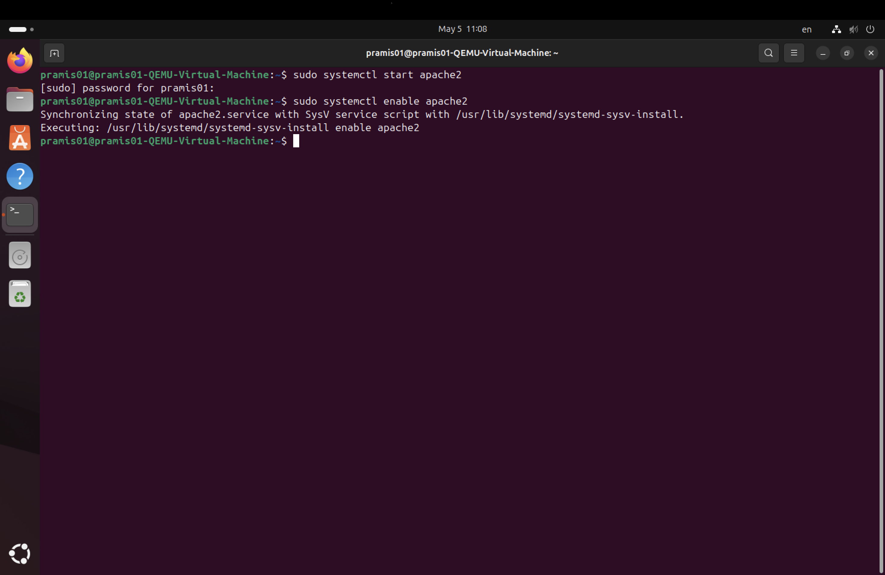
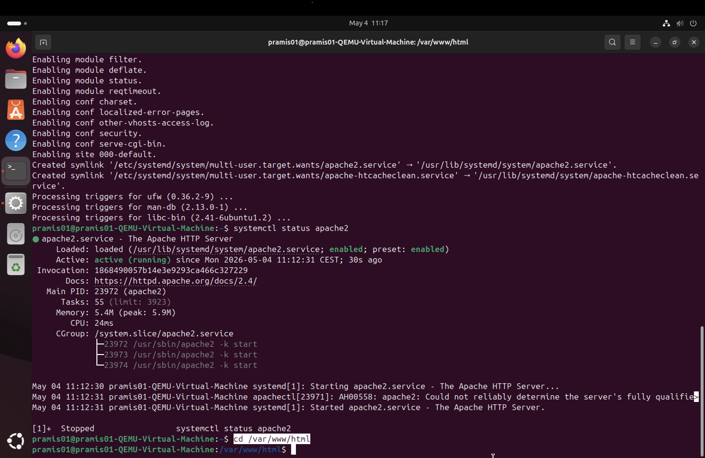
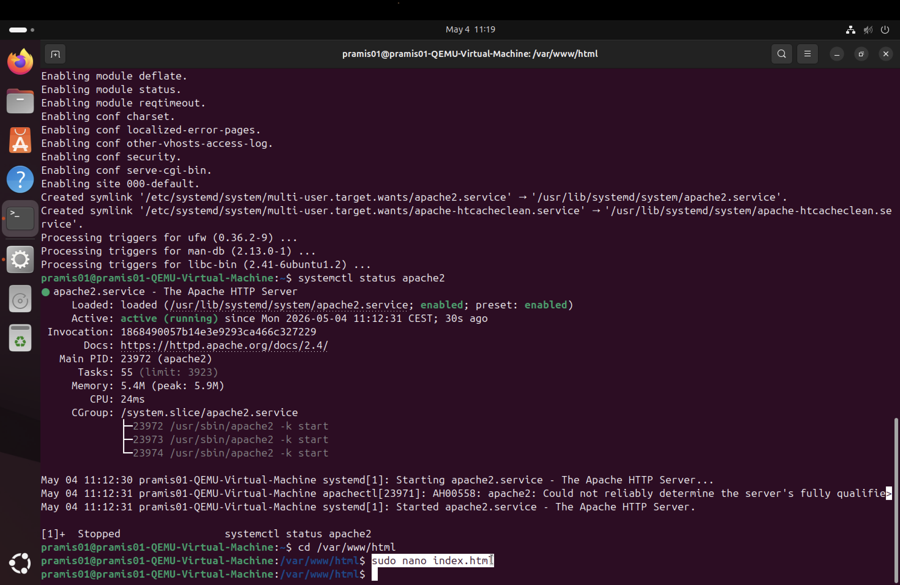
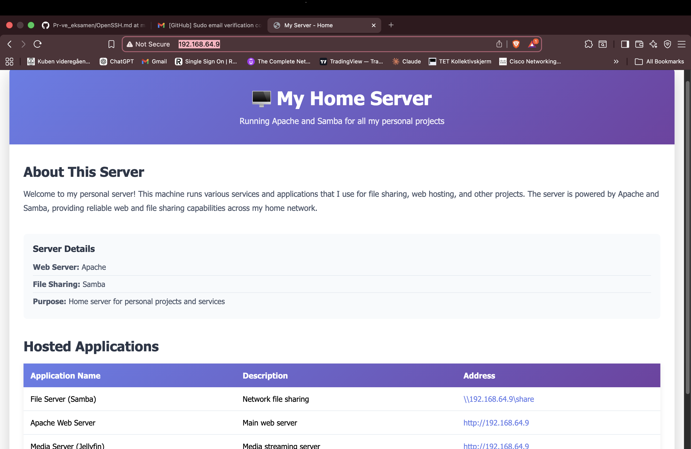

# Apache Web Server Documentation

## Overview

In this project, I implemented Apache on an Ubuntu server to host and deliver a simple website over a local network. Apache acts as a web server that responds to client requests and serves web content through a browser.

---

## Purpose

The purpose of using Apache is to:

* Host a website on a local server
* Deliver web content to clients via HTTP
* Demonstrate how web servers work in a client-server model

---

## Installation

### Install Apache on Ubuntu

```bash
sudo apt update
sudo apt install apache2 -y
```

---

### Start and Enable Apache

```bash
sudo systemctl start apache2
sudo systemctl enable apache2
```

---

### Check Apache Status

```bash
systemctl status apache2
```

The service should show as `active (running)`.



---

## Default Web Directory

Apache stores website files in:

```bash
/var/www/html
```

---

## Creating a Web Page

Edit the default page:

```bash
sudo nano /var/www/html/index.html
```




 

Save and refresh the browser to see changes.

---

## Accessing the Website

From a client (Mac browser), access the site using:

```text
http://server-ip
```

This sends an HTTP request to the server on port 80.

---

## Firewall Configuration

Allow HTTP traffic:

```bash
sudo ufw allow 80
```

---

## How It Works

* Client enters server IP in browser
* Browser sends HTTP request to server (port 80)
* Apache receives request
* Apache returns the web page (HTML)
* Browser displays the page

---

## Testing and Verification

* Open browser and enter server IP
* Confirm that the webpage loads
* Modify `index.html` and refresh to verify changes

---

## Troubleshooting

If the website is not accessible:

* Check Apache status:

```bash
systemctl status apache2
```

* Restart Apache:

```bash
sudo systemctl restart apache2
```

* Check firewall:

```bash
sudo ufw status
```

* Verify correct IP address

---

## Conclusion

Apache enables the server to host and deliver web content over the network. It is a key component in demonstrating how web services operate in a client-server environment.
