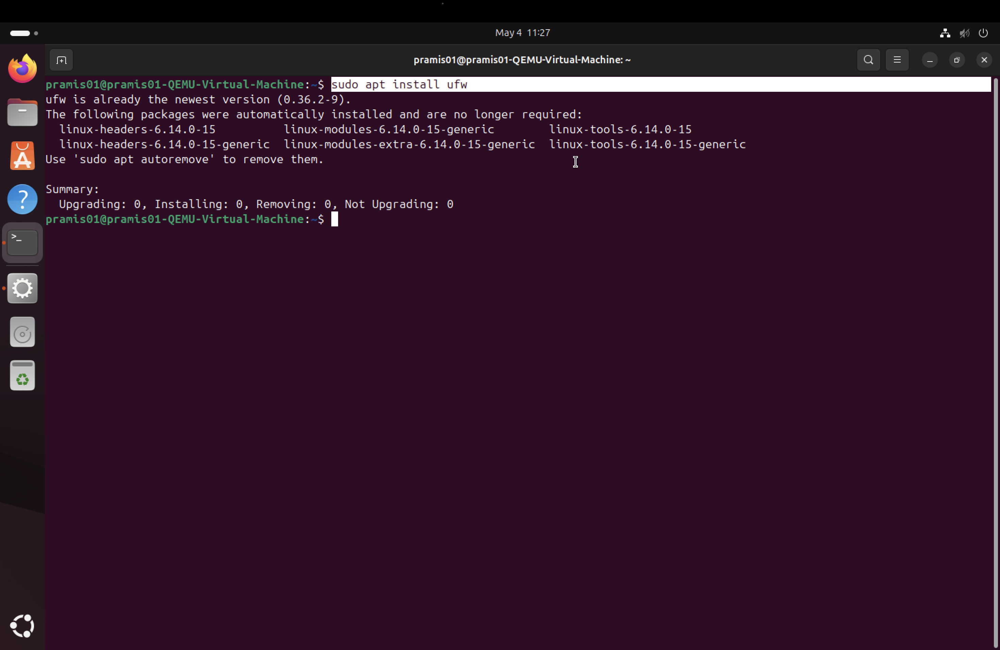
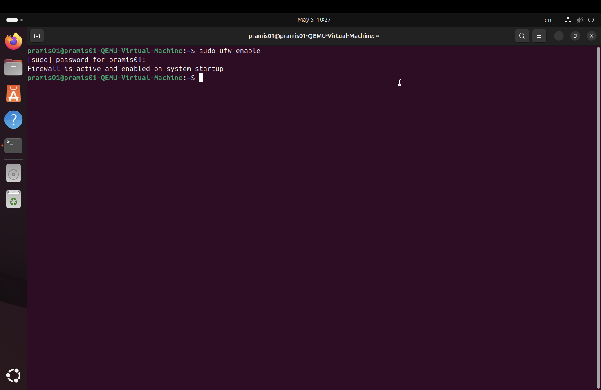
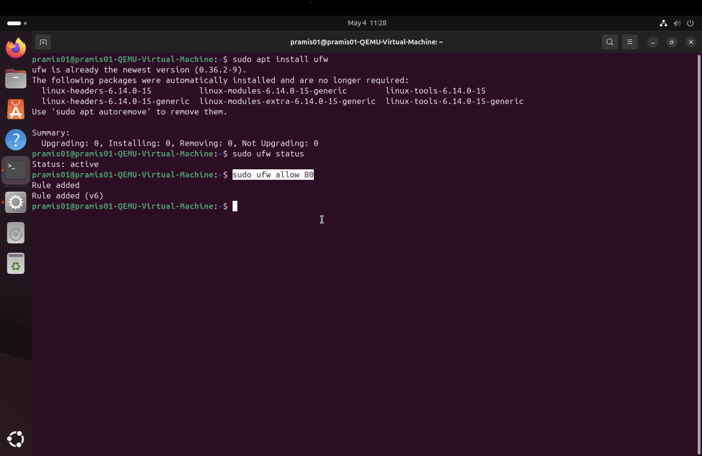
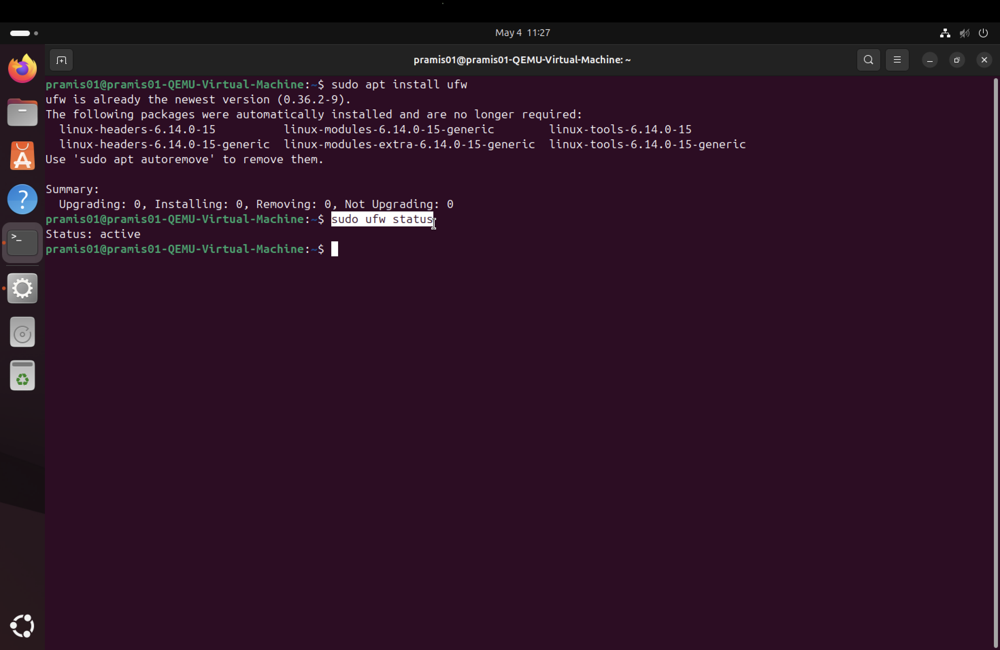

# Firewall Documentation (UFW)

## Overview

In this project, I implemented a firewall using UFW (Uncomplicated Firewall) on an Ubuntu server to control network traffic and improve security. The firewall ensures that only necessary ports are open, reducing the risk of unauthorized access.

---

## Purpose

The purpose of the firewall is to:

* Restrict unwanted incoming connections
* Allow only required services to be accessible
* Improve overall system security

---

## Firewall Tool

* UFW (Uncomplicated Firewall)
* Default firewall tool for Ubuntu
* Easy to configure and manage

---

## Configuration Steps

### 1. Install UFW

```bash
sudo apt install ufw
```

---

### 2. Enable Firewall

```bash
sudo ufw enable
```

---

### 3. Allow Required Ports

The following ports were opened to support the services running on the server:

* Port 22 (SSH – remote access)

```bash
sudo ufw allow 22
```

* Port 80 (HTTP – web server)

```bash
sudo ufw allow 80
```


* Port 445 (Samba – file sharing)

```bash
sudo ufw allow 445
```

---

### 4. Check Firewall Status

```bash
sudo ufw status
```


This command shows which ports are open and whether the firewall is active.

---

## Security Considerations

* Only necessary ports are opened
* All other ports remain blocked by default
* SSH access is secured using key-based authentication
* The firewall helps reduce exposure to network attacks

---

## Testing and Verification

To verify that the firewall works correctly:

* Attempt to access the web server via browser (port 80)
* Connect via SSH (port 22)
* Access shared files using Samba (port 445)

If these services work and other ports are blocked, the firewall is correctly configured.

---

## Troubleshooting

If a service is not accessible:

* Check if the correct port is open:

```bash
sudo ufw status
```

* Verify correct IP address is used

---

## Conclusion

The firewall is an essential part of the server setup. By controlling which ports are open, it helps secure the system while still allowing necessary services to function properly. 
