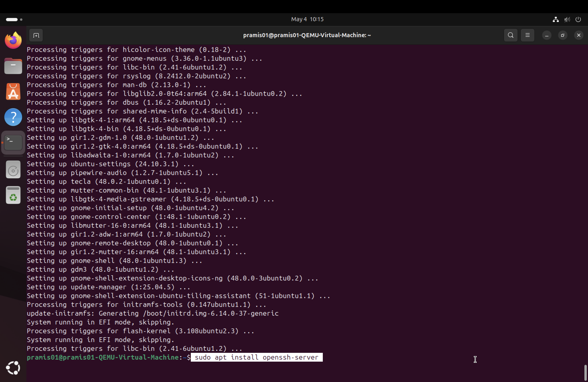
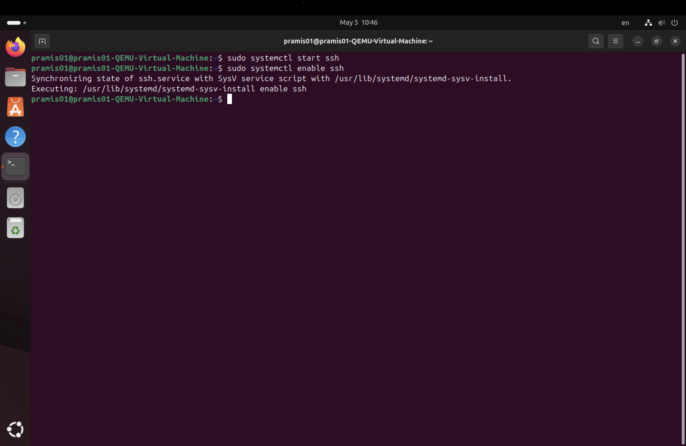
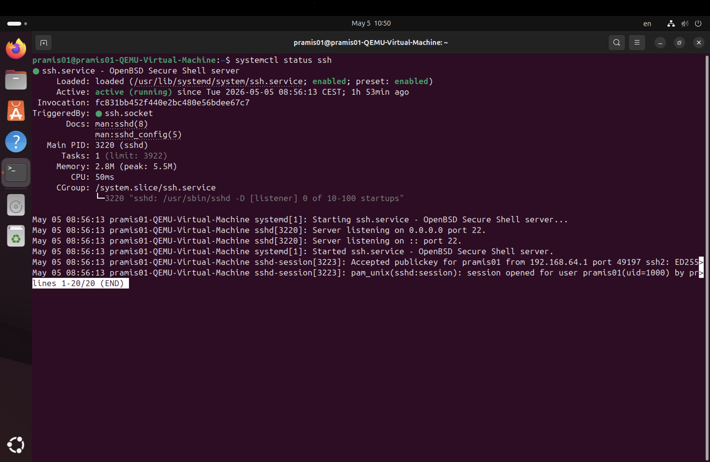
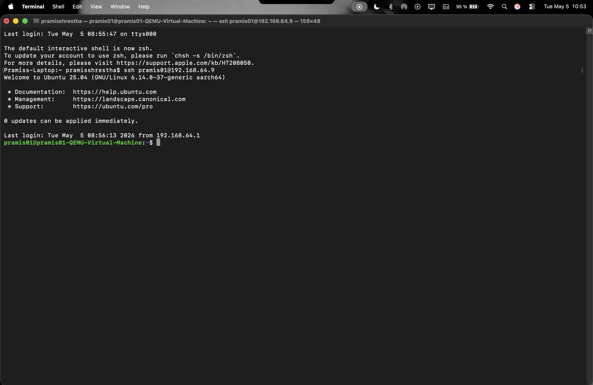
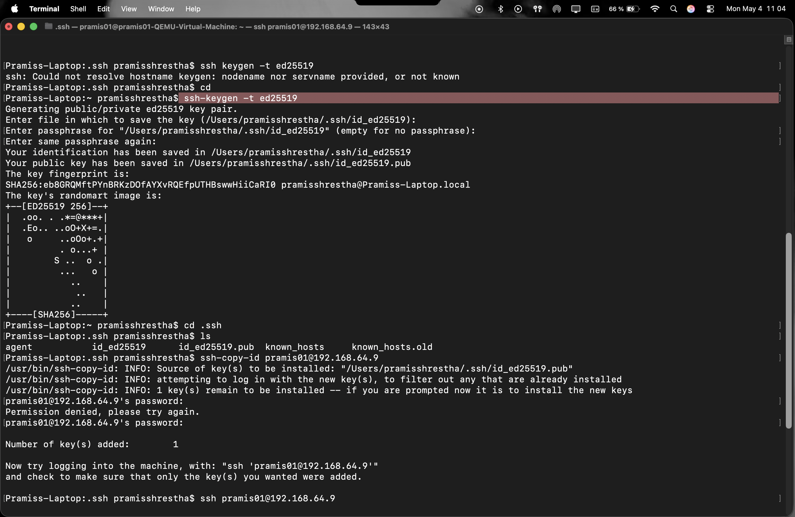
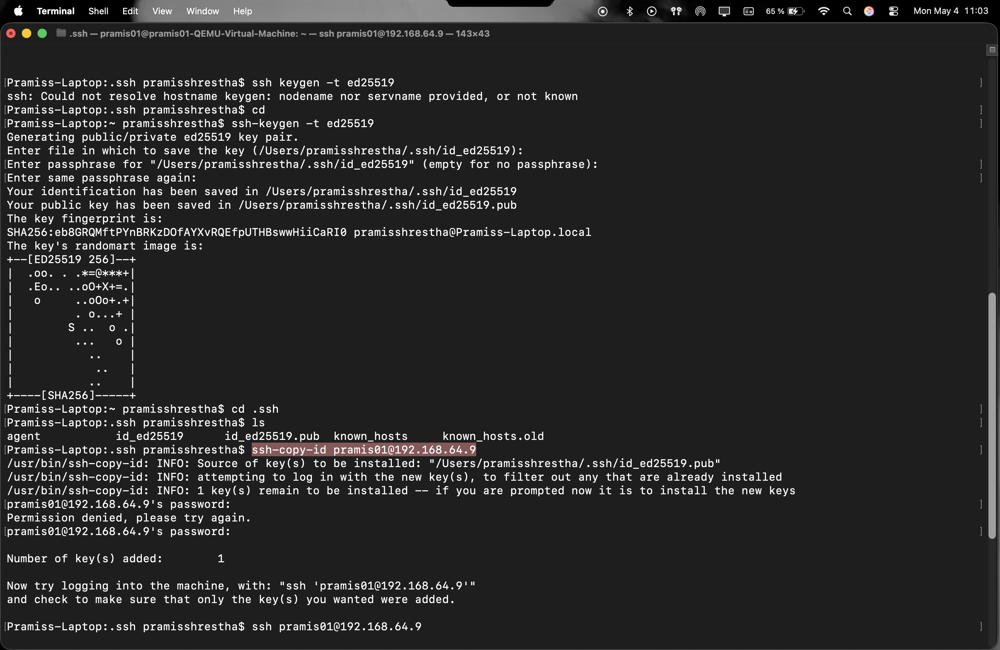
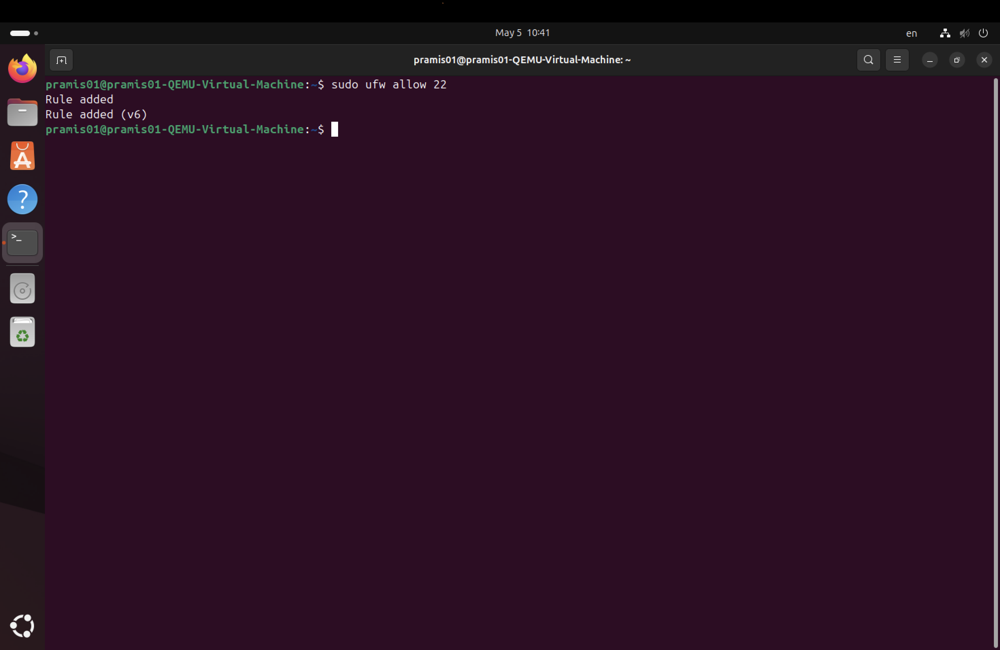

# OpenSSH Documentation

## Overview

In this project, I implemented OpenSSH on an Ubuntu server to enable secure remote access from a Mac client. This allows the server to be managed through the terminal without needing direct physical access.

---

## Purpose

The purpose of using SSH is to:

* Remotely manage the server
* Execute commands securely over a network
* Transfer data safely between client and server

---

## Setup Environment

* Client: Mac (Terminal)
* Server: Ubuntu (running in UTM virtual machine)
* Network: Local network using server IP address

## Installation

### Install OpenSSH Server on Ubuntu

```bash
sudo apt update
sudo apt install openssh-server -y
```

---

### Start and Enable SSH Service

```bash
sudo systemctl start ssh
sudo systemctl enable ssh
```

---

### Check SSH Status

```bash
systemctl status ssh
```

The service should show as `active (running)`.


---

## Connecting from Mac

From the Mac terminal, connect to the server using:

```bash
ssh username@server-ip
```

Example:

```bash
ssh ubuntu@192.168.x.x
```

---

## SSH Key Authentication

### Generate SSH Key on Mac

```bash
ssh-keygen -t ed25519
```

Press Enter to use default file location.


---

### Copy Public Key to Server

```bash
ssh-copy-id username@server-ip
```

---

### Test Key-Based Login

```bash
ssh username@server-ip
```

Login should work without a password.

---

## Security Configuration

### Disable Password Authentication

Edit SSH config:

```bash
sudo nano /etc/ssh/sshd_config
```


Change:

```bash
PasswordAuthentication no
```


Restart SSH:

```bash
sudo systemctl restart ssh
```

---

## Firewall Configuration

Allow SSH through firewall:

```bash
sudo ufw allow 22
```

---

## Testing and Verification

* Connect from Mac using SSH
* Verify login works without password
* Ensure server responds to commands

---

## Troubleshooting

If connection fails:

* Check SSH service status:

```bash
systemctl status ssh
```

* Check firewall rules:

```bash
sudo ufw status
```

* Verify correct IP address
* Ensure SSH port (22) is open

---

## Conclusion

OpenSSH provides secure and efficient remote access to the server. By using SSH keys and disabling password authentication, the system is protected against unauthorized access while allowing easy management from the client machine.
